# Olivier Lowe

### Software Developer · Python & Django · Angular & TypeScript

Building practical web applications with clear business rules, reliable APIs, and maintainable code.

[Portfolio](https://www.olivierlowe.com) · [LinkedIn](https://www.linkedin.com/in/olivier-lowe-04b026284/) · [Email](mailto:olivierentwicklung@gmail.com)

---

## About me

I'm a software developer with more than four years of professional development experience, including Angular frontend development at Freenet DLS GmbH.

My work has included building and maintaining frontend applications, coordinating requirements with backend developers, and contributing to the structure of a frontend monorepository. I bring that experience to Python backend development, supported by completed backend training at Developer Akademie and practical Django projects.

I care about making complex requirements understandable—for the people using the application and the developers maintaining it.

**My approach:** understand the problem, keep business rules explicit, test the behavior, and introduce architectural boundaries when there is a concrete reason for them.

## Selected work

### Coderr — Freelance marketplace

A web application for a freelance marketplace, with separate frontend and backend repositories.

🌐 [Live frontend demo](https://olivierentwicklung.github.io/coderr_frontend/) ·  💻 [Backend source](https://github.com/Olivierentwicklung/coderr_backend)

### Angular monorepository — Frontend architecture

An Angular monorepository exploring organization around business domains, with simulated REST and GraphQL backends. The project focuses on code ownership and frontend boundaries.

**Focus:** Angular · TypeScript · Nx · Domain-Driven Design · REST · GraphQL

### Portfolio — Experience, projects, and technical work

My developer portfolio brings together my professional background, selected projects, and approach to software development.

**Built with:** Angular · TypeScript · Tailwind CSS

[Visit portfolio](https://www.olivierlowe.com)

## Backend projects

- **Videoflix:** a Django REST Framework training project with PostgreSQL, JWT authentication, asynchronous media processing, automated tests, and Docker Compose.
- **Quizly:** a Django project with relational data models, access control, and a tested AI integration.

## Technical skills

| Area | Technologies and practices |
| --- | --- |
| Backend | Python, Django, Django REST Framework, REST APIs |
| Frontend | TypeScript, JavaScript, Angular, HTML, CSS, Sass, Tailwind CSS, PrimeNG |
| Data | PostgreSQL, SQLite, MySQL, Redis |
| Testing | pytest, Vitest, Jest, Cypress, test-driven development |
| Architecture & integration | Business-focused design, Domain-Driven Design, Nx monorepositories, GraphQL clients |
| Delivery & tooling | Docker, Git, GitHub Actions, Postman |

Additional tools and technologies

Ionic · Firebase · Zod · IONOS · Google Cloud · Figma · Jira · VS Code · IntelliJ IDEA

## Current focus

- Building Python and Django backends with tested business behavior and clear API contracts.
- Connecting Angular frontends to backend services.
- Writing two software architecture books using the fictional NovaTrade project: one covering Python, Django, and Flask; the other TypeScript, Angular, and React.

The books follow a principle that also guides my development work: **Pressure before pattern.** Architectural decisions should respond to an observed problem and be supported by evidence.

## Education

| Qualification | Institution | Period |
| --- | --- | --- |
| Completed professional training — Backend Web Development | Developer Akademie GmbH | March–August 2026 |
| Bachelor of Engineering — Computer Engineering (Technische Informatik) | Hochschule Pforzheim | September 2013–October 2018 |

---

<h2>🔹 GitHub Stats</h2>
<!--

  Replace <code>YOUR_GITHUB_USERNAME</code> with your real GitHub username.

-->

  

  

  

  

---

## Let's connect

I'm interested in Python backend and full-stack opportunities where I can contribute my Angular experience and continue developing reliable backend systems.

[Explore my portfolio](https://www.olivierlowe.com) · [Connect on LinkedIn](https://www.linkedin.com/in/olivier-lowe-04b026284/) · [Send me an email](mailto:olivierentwicklung@gmail.com)

Outside software development, I enjoy fitness, cooking, reading, and dancing.
